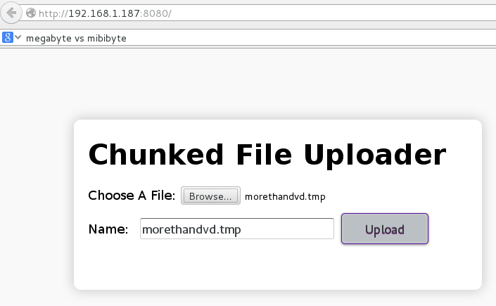

http-uploader
=============

Also known as VCU: Vasnake web Chunked Uploader.
You can upload files of any size over HTTP using resumable file upload service.

HTML5 FileAPI + Node.js + Socket.io -- http://vasnake.blogspot.ru/2012/06/resumable-http-file-upload.html

* app.js -- Node.js application
* index.html -- web application



### Install

This instructions was tested on CentOS 6.4

Install Node.js

```sh
su -l
yum update
yum groupinstall "Development Tools"
wget http://nodejs.org/dist/v0.10.33/node-v0.10.33.tar.gz
tar zxf node-v0.10.33.tar.gz
cd node-v0.10.33
./configure
make
make install
```

Create app and install Socket.io

```sh
su -l valik
mkdir -p ~/nodevcu && cd $_
npm install socket.io
svn checkout https://github.com/vasnake/http-uploader/trunk/node.uploader ./
mkdir Repo; mkdir Temp;
```

### Run

Run Node.js app

```sh
su -l valik
cd nodevcu
node app.js
```

Suppose you have installed Node.js on localhost,
open URL http://localhost:8080/ in your web browser and upload any file.

If you have some strange problems, try to decrease
chunkSize variables in app.js and index.html.
Chrome browser works faster, but less stable with large chunkSize value.

### HTTPS reverse proxy

In case you want to run this app behind HTTPS reverse proxy.
Lets assume, your host named alwaysgloom.sytes.net and
Apache httpd config looks like this:

```
# /etc/apache2/sites-available/rover-ssl.conf
...
<Location /node/vcu/>
        Order allow,deny
        allow from all
        AuthType Basic
        AuthUserFile /home/valik/.htpasswd
        AuthName "Alwaysglum restricted services"
        Require valid-user
    ProxyPass http://localhost:8080/
</Location>
...
```

In that case, you need to change index.html file
according to this snippet:

```
// index.html
// app behind https proxy
var socket = io.connect(
    'https://alwaysgloom.sytes.net',
    {path: '/node/vcu/socket.io'});
```

### Links

* How to Create a Resumable Video Uploader in Node.js -- http://code.tutsplus.com/tutorials/how-to-create-a-resumable-video-uploade-in-node-js--net-25445
* How To Install And Run A Node.js App On Centos 6.4 -- https://www.digitalocean.com/community/tutorials/how-to-install-and-run-a-node-js-app-on-centos-6-4-64bit
