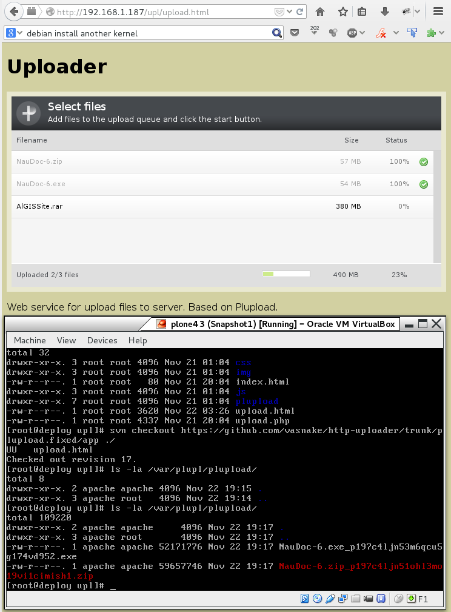

http-uploader
=============

Also known as VCU: Vasnake web Chunked Uploader.
You can upload files of any size over HTTP using resumable file upload service.

In 2010 Plupload wasn't good enough for me, so I had to fix it. There it is:
Plupload (PHP + Flash/Silverlight), fixed and tested -- http://vasnake.blogspot.ru/2010/11/chunked-upload.html

With Plupload you can't upload file bigger than 500 MB in one piece.
If you had to, split that file to smaller chunks with any file splitting tool,
then upload a bunch of chunks.

* app -- web app folder
* httpd.conf.diff -- Apache HTTPd config example
* php.ini.diff -- PHP config example



### Install

This instructions was tested on CentOS 6.4

Install Apache httpd + php

```sh
su -l
yum install httpd
chkconfig httpd on
yum install php
service httpd restart
nano /var/www/html/test.php
```

test.php

```php
<?php phpinfo(); ?>
```

Check the page http://servername/test.php
to be sure that PHP working as expected.
Then copy app files to web server:

```sh
mkdir -p /var/www/html/upl && cd $_
svn checkout https://github.com/vasnake/http-uploader/trunk/plupload.fixed/app ./
```

### Run

Go to http://servername/upl/upload.html
and upload any file.

### Links

* Plupload official site -- http://www.plupload.com/index.php
* Fixed Plupload -- http://vasnake.blogspot.ru/2010/11/chunked-upload.html
